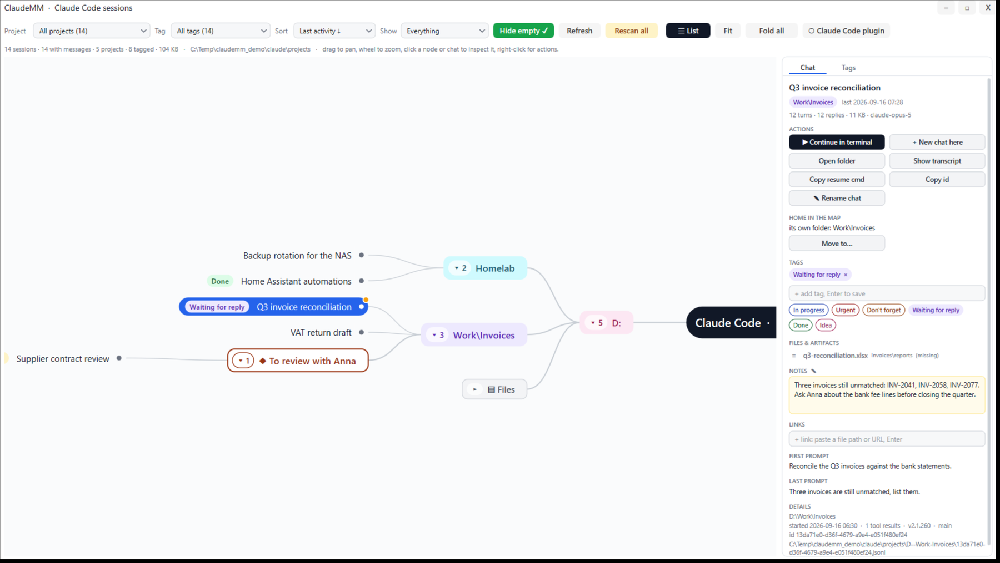
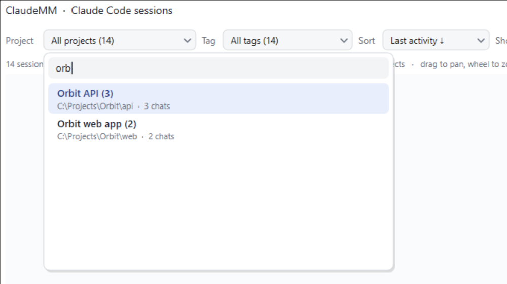
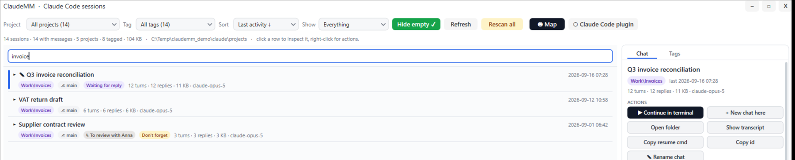

<p align="center">
  
</p>

<h1 align="center">ClaudeMM</h1>

<p align="center">
  A mind map of your Claude Code sessions, for Windows.<br>
  Find the chat you had three weeks ago, organise your projects the way you think, and let Claude search it all.
</p>

<p align="center">
  
</p>

Claude Code keeps every conversation on disk, but finding *that one chat where we fixed the webhook retries* means scrolling through a flat list of first prompts. ClaudeMM reads those transcripts and turns them into a map you can pan, zoom, fold, tag and annotate, and it plugs back into Claude Code so the map is one command away from any session.

## What you get

**The map.** Every working directory becomes a branch, every chat a leaf. Fold what you do not care about, zoom into what you do. Add your own nodes ("Roadmap Q4", "To review with Anna"), drag chats into them, give folders friendlier names. Live sessions pulse green; a session waiting for your permission answer turns amber.

**Unfold a chat and see what came out of it.** Its note, the artifacts it published, the files it wrote (missing ones greyed), your links; every folder also carries an "Artifacts" branch with everything its chats produced. Today's chats get an accent bullet, chats untouched for a month fade to grey.

**Search that means it.** Titles, prompts, folders, branches, tags, the files a chat wrote, and your notes. Type in the list and the map narrows to the results and the folders above them.

**Tags and notes.** Five presets (In progress, Urgent, Don't forget, Waiting for reply, Done) plus your own, with colours. A free-text note on any chat or node, autosaved, searchable, marked with a ✎ wherever it appears.

<p align="center">
  
</p>

**Continue where you left off.** Open the chat in the Claude desktop app, or in a terminal with `claude --resume`. Start a new chat in any folder from the map.

**A project picker you can type into.** Names come from the aliases you gave the folders in the map.

**Your dev servers, where they belong.** Every project that runs something on a local port gets a "Servers" branch: the recipes come from the project's `.claude/launch.json`, from the start commands Claude actually ran in your chats (`npm run dev`, `uvicorn app:app --port 8000`, `fava --port 5111`...), or, failing both, from `package.json`. The map shows which ports are listening right now (the globe turns green), and the inspector gives you Open, Start and Stop: Start runs the recipe in its own console, Stop takes the whole process tree down. Filter with *Show → Web servers / Listening now*, search for a port or a tool name, or ask Claude through the `web_servers` MCP tool.

<p align="center">
  
</p>

<p align="center">
  
</p>

## The Claude Code plugin

This repository is a Claude Code plugin marketplace. Installing the plugin gives every Claude Code session, terminal or desktop app, three things:

| | |
|---|---|
| **`/claudemm:mm`** | Shows the current chat in the map: clears the search, zooms to it, blinks it for a moment. |
| **`/claudemm:tag`** | Tags the current chat (`/claudemm:tag Urgent, Fiscal`; with no arguments Claude picks the tags). Claude also tags the chat it is in on its own: an untagged chat gets a one-line reminder on its second prompt, and every tool accepts `id: "current"`. |
| **MCP tools** | Claude can search and read your session index and organise it: `search_sessions`, `list_sessions`, `get_session`, `list_projects`, `list_tags`, `set_tags`, `rename_session`, `set_note`, `show_in_map`, `open_session`, `rescan`, and `web_servers` (list / start / stop / open the dev servers of your projects, with their live state). Ask *"which sessions did I tag Urgent?"*, *"find the chat about the Postgres migration and open it"* or *"is the frontend dev server up? start it"*. |
| **Live hooks** | Session start / prompt / stop / notification events reach the map, so running sessions pulse and finished ones settle, without polling. |

## Install

Requirements: Windows 10/11 (x64) and [Claude Code](https://claude.com/claude-code) signed in.

```bash
claude plugin marketplace add vider73/claudemm
claude plugin install claudemm@chronoscan
```

That is all: the plugin ships the app itself (`ClaudeMM.exe`, about 1 MB, plus one DLL). Open a Claude Code session and type `/claudemm:mm`, or start the window from the plugin's `bin` folder and pin it.

To update later:

```bash
claude plugin update claudemm@chronoscan
```

Prefer a classic install with a Start Menu entry? The Windows installer is in [`installer/`](installer/): run it, keep "Register with Claude Code" ticked, and it sets the plugin up for you. ClaudeMM checks for newer versions on start and shows a green button when there is one; it never downloads or installs anything by itself.

## Privacy

ClaudeMM reads the transcripts Claude Code already writes under `~/.claude/projects` (and the desktop app's local sandboxes). It never modifies them, never uploads anything, and keeps everything it adds (tags, notes, nodes, aliases, window state) in small text files under `%APPDATA%\ChronoUI`. Remove that folder and it is as if it never ran.

## How it is built

Win32 and Direct2D, one exe, no runtime to install. The same binary is the window, the MCP server (`--mcp`), the hook forwarder (`--hook`) and the plugin registrar. It lives inside [ChronoUI](https://github.com/vider73/ChronoUI), a small immediate-mode widget framework, in the `ClaudeMM` folder.

## Licence

MIT.
